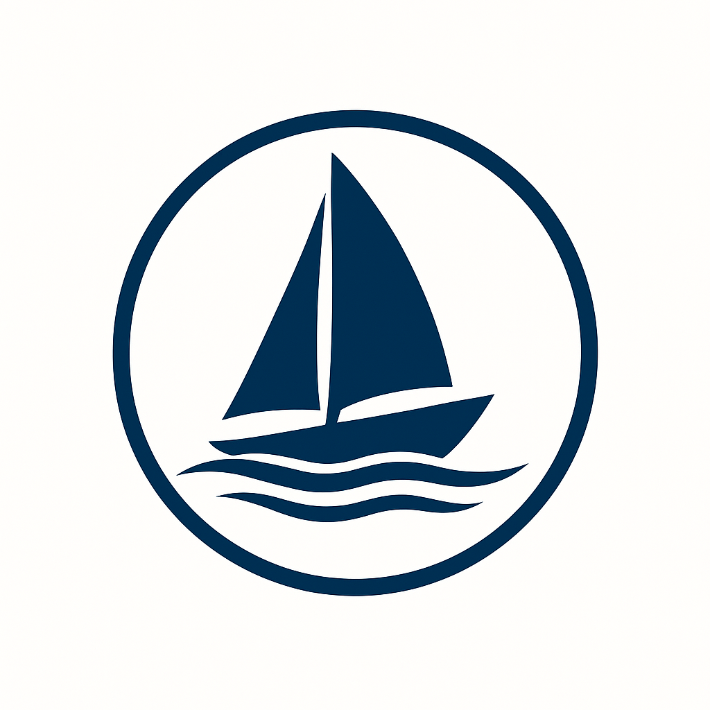

<table>
  <tr>
    <td></td>
    <td><h1 style="margin-left: 10px;">HR Tracker Function</h1></td>
  </tr>
</table>

**SailboatTracker** is an Azure Function project designed to log and retrieve sightings of Hallberg-Rassy sailboats during a sailing trip. It exposes two HTTP endpoints for storing and fetching boat data in Azure Table Storage.

This project was created as part of a technical interview test — and inspired by real-life sailing aboard a Hallberg-Rassy 352 from 1979.

---

## 🚀 Features

- **POST /api/boats**  
  Accepts a JSON payload representing a Hallberg-Rassy boat and stores it in Azure Table Storage.

- **GET /api/boats**  
  Returns all stored boat entries.
-
- **DELETE /api/boats**  
  Deletes all boat entries in the table.

---

## 📦 Example JSON Payload

```json
{
  "model": "HR 352",
  "boatName": "Tembo",
  "lengthFeet": 35,
  "yearBuilt": 1979,
  "locationSpotted": "Ellös",
  "dateSpotted": "2025-08-05T14:30:00Z"
}
```

---

## 🧪 Running Locally

```bash
# 1. Clone the repository
git clone https://github.com/renate/hr-tracker-function.git
cd hr-tracker-function

# 2. Ensure Azure Storage Emulator is running or use connection string
# In local.settings.json:
{
  "AzureWebJobsStorage": "UseDevelopmentStorage=true",
  "FUNCTIONS_WORKER_RUNTIME": "dotnet"
}

# 3. Start the Azure Function locally
func start
```

## 🧭 Technologies Used
- Azure Functions (.NET)
- Azure Table Storage
- C#
- HTTP Trigger
- JSON Serialization
- Dependency Injection
- ITableEntity
- async/await programming

---
## 📌 Notes
This project runs locally in debug mode.
Azure subscription and storage account are required for testing. 
You can use the Azure Storage Emulator or Azurite for local development by setting the connection string to `UseDevelopmentStorage=true` in `local.settings.json`.
Designed as part of a technical interview test.
Inspired by sailing aboard a Hallberg-Rassy 352 in Kattegat.

---
## 👩‍💻 Author
Renate sailing around in Kattegat aboard a Hallberg-Rassy 352 from 1979 while building cloud-native solutions. Combining maritime adventure with modern software engineering.

